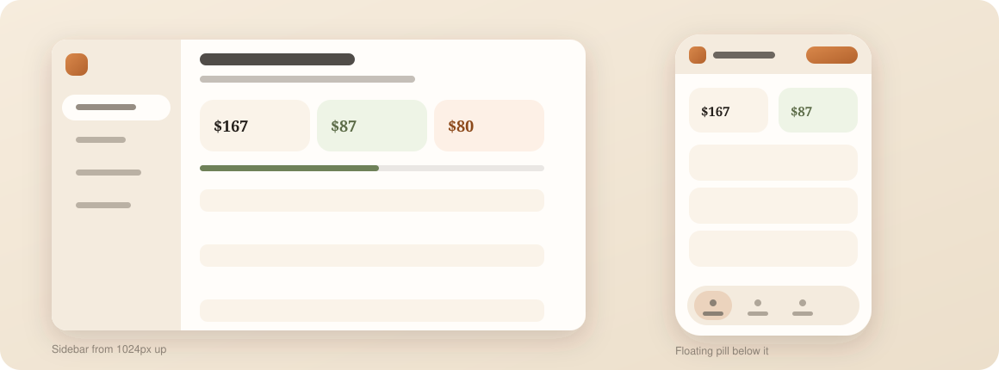

<br/>

<div align="center">

**Sahafi Rent Book** &nbsp;·&nbsp; `v1.0.0` &nbsp;&nbsp; *First release — August 2026*

A zero-server, single-file credit ledger built for restaurant staff.&nbsp;
Track every plate served on credit, set payment deadlines, collect in full — in English or Somali.

[](https://uncannystranger.github.io/sahafi-restuarant/app/)
[](https://github.com/uncannystranger/sahafi-restuarant/releases/tag/v1.0.0)
[](LICENSE)

</div>

---

## About

**Sahafi Rent Book** (*Buugga Deynta* in Somali) was built for the real world of a small restaurant — where a customer walks in, eats on trust, and promises to pay on Friday. The owner needs one thing: a clear, fast record of who ate what, how much is still owed, and who is overdue.

This app is that record.

It runs entirely inside a single HTML file — no backend, no database, no account sign-up. Everything is stored in the browser's `localStorage`. Open the file, start typing; the book is ready. It works equally well on the desktop behind the counter or on the owner's phone across town.

The design takes cues from warm Somali café aesthetics — a cream ground, terracotta accents, glassmorphic surfaces — then layers a precise, Apple-inspired information hierarchy on top, so figures always read first and chrome fades into the background.

**First release — v1.0.0 · August 2026**

---

## How it works



<br/>

| Step | What the staff does |
|------|---------------------|
| **Served** | Tap **Add Record**, enter the customer name, food and price. One tap saves. |
| **Promised** | Optionally set the expected payment date and time — the book flags it automatically when it is overdue. |
| **Part paid** | Log a partial payment with **Pay**. The remaining balance (haraa) updates instantly. |
| **Settled** | When the balance hits zero the status badge flips to *Paid in Full* automatically. No extra step. |

---

## Features

### 📋 Rent Book
Log every credit meal in seconds. Set an expected payment date and time. Add a note (*"promised after Friday prayer"*). Filter by status — All · Unpaid · Partial · Overdue · Paid. Rows appear with a staggered rise animation that respects `prefers-reduced-motion`.

### 👥 Customer Accounts
Each customer has a full account page: total consumed, amount collected, outstanding haraa, complete food history, payment timeline, and an upcoming payment schedule. Sort by highest debt, most recent transaction, or alphabetically.

### 📊 Dashboard
At a glance — total consumed, collected, outstanding haraa, collection rate bar, overdue alerts and a quick-look at who owes the most. Stat cards animate in on load and hover with a subtle lift.

### 📄 Monthly Report
A print-ready statement of the whole book: financial summary, customer accounts, transaction history, payments received. On narrow screens each row becomes a labelled card — no sideways scrolling, no hidden numbers. Fully printable with `@media print` styles.

### 🌐 Bilingual — English / Somali
Every label, status, date format, error message and composed sentence is available in both English and Somali. Somali uses correct word order (*"31 Agoosto 2026"*) rather than slotting words into an English frame. Toggle in the sidebar or Settings.

### 🎨 Design system
- Warm cream ground with radial terracotta and sage gradients
- Glassmorphic chrome — `backdrop-filter: blur(22px)` with opaque fallback for older browsers
- Lora (serif, headings & figures) + Poppins (sans, interface text)
- Press-ripple feedback on every interactive element
- Stagger animations, bar sheen sweeps, badge-pop and overdue-pulse effects

### 📱 Responsive — sidebar ↔ pill bar



<br/>

- **≥ 1024 px** — sticky 252 px sidebar
- **< 1024 px** — floating glass pill navigation bar anchored above the home indicator
- Every layout reflows with CSS Grid — no JavaScript breakpoint logic

---

## Getting started

```bash
# 1 · Clone
git clone https://github.com/uncannystranger/sahafi-restuarant.git
cd sahafi-restuarant

# 2 · Open
open app/index.html        # macOS
start app/index.html       # Windows
xdg-open app/index.html    # Linux
```

No build step. No `npm install`. The file is self-contained.

> **Tip:** For the best experience on mobile, serve the file over a local HTTP server (`python3 -m http.server` or `npx serve .`) so the app can be added to the home screen as a PWA.

---

## Project structure

```
sahafi-restuarant/
├── app/
│   └── index.html          # The entire application — HTML, CSS and JS in one file
├── .github/
│   └── assets/
│       ├── hero.svg        # Animated README banner
│       ├── flow.svg        # Record lifecycle diagram
│       └── responsive.svg  # Desktop / mobile layout diagram
└── README.md
```

---

## Data & privacy

All data lives in `localStorage` under the keys `sahafi.rentbook.v2` and `sahafi.profile.v1`. Nothing is ever sent to a server. Clearing browser storage resets the book to the built-in demo data, which can also be restored any time from **Settings → Reset demo data**.

---

## Browser support

| Browser | Minimum version |
|---------|----------------|
| Chrome / Edge | 88 + |
| Firefox | 90 + |
| Safari / iOS | 15.4 + |
| Samsung Internet | 14 + |

Older browsers that do not support `backdrop-filter` receive a clean opaque surface fallback via `@supports`.

---

## Roadmap

- [ ] PWA manifest + service worker for full offline use
- [ ] CSV / Excel export of the rent book
- [ ] WhatsApp payment-reminder deep-link per customer
- [ ] Multi-restaurant support (separate books, one device)
- [ ] Cloud sync option (optional, user-controlled)

---

## License

Released under the [MIT License](LICENSE). Free to use, modify and distribute.

---

<div align="center">

*Made with care for the small restaurant that runs on trust.*

**صحافي** &nbsp;·&nbsp; Sahafi Restaurant &nbsp;·&nbsp; Mogadishu, Somalia

</div>
